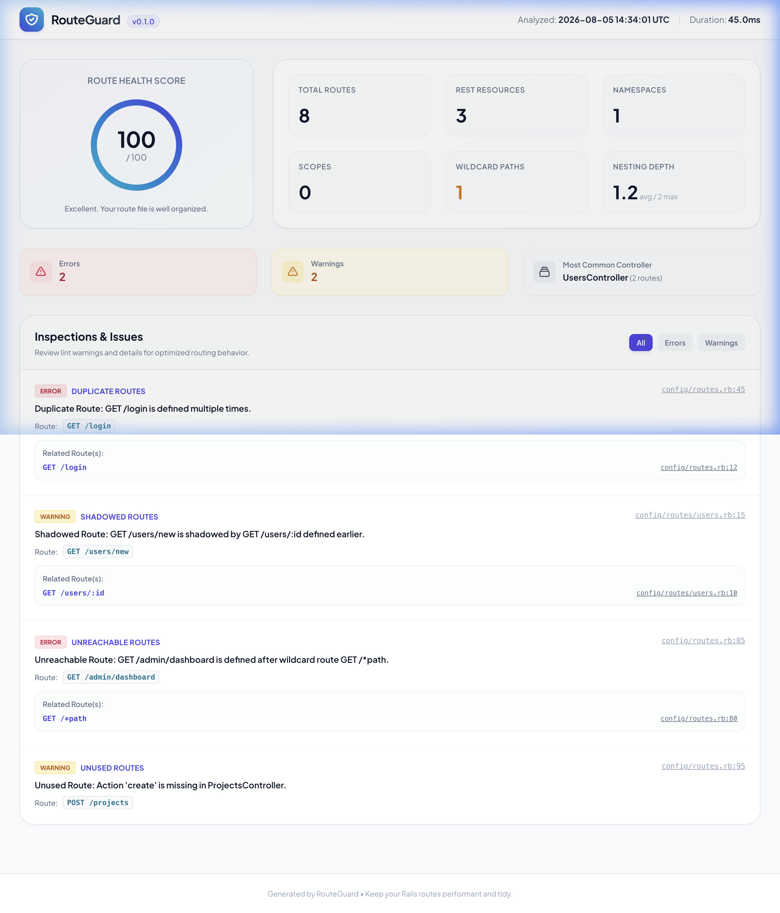

# RouteGuard 🛡️

RouteGuard is a production-ready static analysis tool for Rails routing. It inspects your Rails routes to catch bugs and issues that Rails itself does not report—such as shadowing, duplicates, unreachable catch-alls, duplicate resource blocks, and dead controller actions.

Designed to be fast, extensible, and run purely during development or CI, RouteGuard helps ensure your routing table is clean and error-free.

---

## 📋 The Problem Statement

In Ruby on Rails, routes are evaluated **sequentially from top to bottom**. As a codebase grows and files span thousands of lines, maintaining routing integrity manually becomes difficult. 

Rails does not report any logical routing errors at boot time. This leaves developers vulnerable to several critical issues:
1. **Route Shadowing**: A catch-all route like `/users/:id` defined before `/users/new` makes the latter completely unreachable. Rails will route all traffic for `/users/new` to the `show` action, silently passing `"new"` as the `:id` parameter.
2. **Duplicate Routes**: Defining the same HTTP verb and path multiple times is silently ignored by Rails; only the last-defined route will be active, making previous definitions dead code.
3. **Duplicate Named Helpers**: Overlapping helper names (e.g., duplicate `welcome_path`) override each other, causing page links to direct to incorrect pages.
4. **Dead / Unused Routes**: Routes pointing to non-existent controllers or missing actions are only caught at runtime, resulting in unexpected `500 Internal Server Errors` for your users.

RouteGuard solves this by statically analyzing your routing tree, verifying controller/action existence, scoring your route health, and providing actionable error reports.

---

## 🖼️ Dashboard Screenshot

Here is the clean and interactive HTML dashboard generated by RouteGuard:



---

## 🚀 Core Features

* **Duplicate Route Detection**: Identifies routes sharing the same HTTP verb and path pattern.
* **Route Shadowing**: Flags routes that will never match because an earlier route takes precedence.
* **Unreachable Routes**: Detects routes defined after global catch-all wildcard routes (e.g. `match "*path"`).
* **Duplicate Named Helpers**: Identifies duplicate helper names that override each other.
* **Duplicate Resources**: Warns when identical resources are declared multiple times in the same namespace scope.
* **Unused Routes**: Checks if the target controller and action method exist in the codebase.
* **Route Statistics**: Computes REST resources count, nested scopes, wildcards, and maximum nesting depth.
* **Health Score**: Computes a 0-100 maintainability score based on issues and path nesting levels.

---

## 📦 Installation

Add RouteGuard to your Gemfile in the `:development, :test` group:

```ruby
group :development, :test do
  gem "route_guard", git: "https://github.com/amriteshtiwari/RouteGuard.git", branch: "main"
end
```

Run bundle install:
```bash
bundle install
```

---

## 🛠️ Command-Line Interface (CLI)

RouteGuard comes with a rich CLI containing subcommands for various analysis tasks.

### 1. `route_guard check` (Default)
Analyzes Rails routes and prints a comprehensive issues report to the console.

```bash
bundle exec route_guard check [OPTIONS]
```

**Options**:
* `--strict`: Treat warnings as errors (exits with code `1` if warnings are found).
* `--fail-on-warning`: Exit with code `1` if any warning is found.
* `--format [terminal|json|html|ci]`: Specify the output format (default: `terminal`).
* `--only [rules]`: Run only the specified rules (comma-separated list).
* `--except [rules]`: Exclude the specified rules from running.
* `--output [file]`: Write the report output to a file instead of `STDOUT`.
* `--verbose`: Print detailed information during execution.

### 2. `route_guard html`
Generates a beautiful, standalone, responsive HTML report (designed in light mode) containing interactive tabs, filters, and statistics.

```bash
bundle exec route_guard html [OPTIONS]
```
* **Options**:
  * `--output [file]`: Custom filename (default: `route_guard_report.html`).

### 3. `route_guard json`
Outputs the complete inspection results in a machine-readable JSON structure, suitable for custom reporting scripts or CI integrations.

```bash
bundle exec route_guard json
```

### 4. `route_guard doctor`
Thoroughly inspects and reports on route health. It enables strict checking, treats warnings as errors, and prints results to the terminal.

```bash
bundle exec route_guard doctor
```

### 5. `route_guard stats`
Calculates and prints routing statistics (namespaces, scopes, wildcards, nesting depths, and controller counts) without running issue rules.

```bash
bundle exec route_guard stats
```

---

## ⚙️ Rake Tasks & Rails Integration

RouteGuard automatically integrates with your Rails app through its built-in Railtie. You can use the following Rake tasks:

* **`bundle exec rails routes:lint`**: Performs a standard linting run on your routes.
* **`bundle exec rails routes:doctor`**: Performs a strict check, exiting with code 1 if any warnings or errors are found.

---

## 📝 License

RouteGuard is available as open source under the terms of the [MIT License](https://opensource.org/licenses/MIT).
